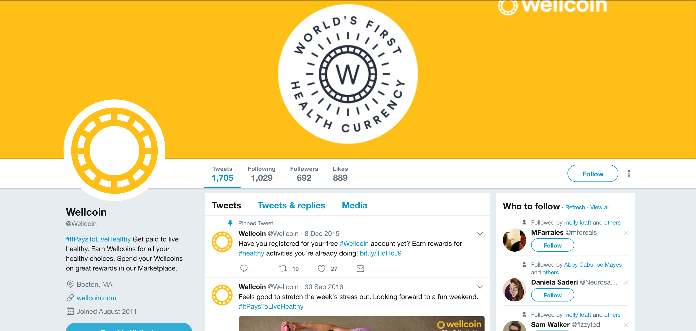

# WEEK `05`: 26 Feb 2018
##  Act: Interventions
This week in Quant Humanists, we will look into the things that motivate behavior change. We will look into digital and physical interventions that are meant to keep us engaged, on track, on schedule, or empowered to make a change in our lives. Which interventions personally work for us? Which ones don’t? How can we use new technologies or relationships to create impactful interventions?

## PROGRAM

**DISCUSSION**:
 
- Review of Week 4 Assignments
- Updates on class’s data collection, positives, pain-points, debugging, and more. 
- Presentation overview 
- [SLIDES URL](https://docs.google.com/presentation/d/1bO7ZcrxedCThtAxMg2WOnh6UheT6TDdUEwyEBycTAWc/edit#slide=id.g322da65d49_0_144)

**Project Highlight**:

[Wellcoin](https://www.digitaltrends.com/health-fitness/wellcoin-health-currency-wearables/)

**STUDIO**:

- Model/Map behavioral change for your data collection project, or area of focus (e.g. improve health, achieve a goal, find triggers, identify relationships, find balance, be mindful, engage in self-experimentation).

## PRACTICE

- [DOG.CEO, an API for dog lovers](https://dog.ceo/)
- [Random Cat Image API](http://random.cat/meow)
- [Random User Generator API](https://randomuser.me/)
- [Glitch.com // "friendly community where you'll build the app of your dreams " ](https://glitch.com/)
- [CRUD Tutorial by Zell Liew](https://zellwk.com/blog/crud-express-mongodb/)

## READINGS

- Ruckenstein, Minna., [Visualized and interacted life: Personal analytics and engagements with data doubles](http://www.mdpi.com/2075-4698/4/1/68pdf)
- Bosker, Bianca., [WeCroak, The App That Reminds You You’re Going to Die
](https://www.theatlantic.com/magazine/archive/2018/01/when-death-pings/546587/)
- Kushner, R. and Mechanick, J. [Communication and Behavioral Change Tools: A Primer for Lifestyle Medicine Counseling](https://link.springer.com/chapter/10.1007/978-3-319-24687-1_3)
- Comm, Joel., [Top 10 Motivational Apps to help nail your resolutions](https://www.inc.com/joel-comm/top-10-motivational-apps-that-will-help-you-nail-your-resolutions.html)
- Clear, James., [How Long Does it Actually Take to Form a New Habit? (Backed by Science)](https://jamesclear.com/new-habit)

## ADDITIONAL RESOURCES

- Goldsmith, Marshall., [An exercise in behavioral change](https://hbr.org/2010/01/an-exercise-in-changing-yourse)
- Grave, Calugi, Centis, El Ghoch, Marchesini., [Cognitive-Behavioral Strategies to Increase the Adherence to Exercise](https://www.ncbi.nlm.nih.gov/pmc/articles/PMC2968119/)
- [Coach.me](https://www.coach.me/) - app to track your momentum toward a goal
- [Get Gratitude](http://getgratitude.co/) - journaling tool to motivate change and thankfulness
- [Think Up](https://itunes.apple.com/us/app/thinkup-positive-affirmations/id906660772?mt=8) - an app to personalize your positive affirmations and schedule reminders
- King, Stephen., [Cat’s Eye - Quitters Inc. (1985)](https://www.youtube.com/watch?v=-2w7ksD0ZlE)
- Berson, Josh., [Computable Bodies: Instrumented Life and the Human Somatic Niche](https://www.bloomsbury.com/uk/computable-bodies-9781472527622/)
- Williams, Kaiton., [The weight of things lost: self-knowledge and personal informatics](http://www.personalinformatics.org/docs/chi2013/williams.pdf)
- [Beeminder, using behavioral economics to keep you on track](https://www.beeminder.com/)

## ASSIGNMENT

This week your assignment is to design a quantified self intervention. In this case, an intervention can any kind of trigger (e.g. push notifications, phone calls from friends, money donations or deductions) that helps to keep you on track with your habits, provides motivation, punishes you, etc. Think about the deeper underlying principles that motivate you, how various services play on those principles, and how you might (ab)use those principles in your own intervention design. 

### Quant Self Intervention
- **About**:  
-  Design or prototype an intervention that would help you to change your behavior based on the data you've gathered. Tech or community or social based interventions are fair game.
-  You will:
    - make your intervention tangible; make it visual or physical in some way. 
    - justify how your intervention works and why it is convinving for you and why it might (or might not) be a useful strategy for others.

You might consider: 
    - paper prototypes, a slide deck, a screen dummy, video, etc
    - using your quant self service idea as a foundation to build your intervention on

- **Submission**: Submit documentation of your quant self intervention - including images, graphics, text descriptions, etc - as a Github Gist/blog post link as a [`comment in its respective github issue` in the quant-humanists-2018 repository](https://github.com/joeyklee/quant-humanists-2018/issues). See NOTE below.
- You will present your concept next class, convince us!

### Blog Post: Reflection
- **About**: short paragraph or phrase on what you learned this week.
- **Submission**: Submit your Github Gist/blog post link as a [`comment in its respective github issue` in the quant-humanists-2018 repository](https://github.com/joeyklee/quant-humanists-2018/issues). See NOTE below.

**NOTE**: Please structure your blog post submissions according to the assignment template here: [Quant Humanist - assignment template](https://github.com/joeyklee/quant-humanists-2018/blob/master/_templates/assignment-submission-template.md)

