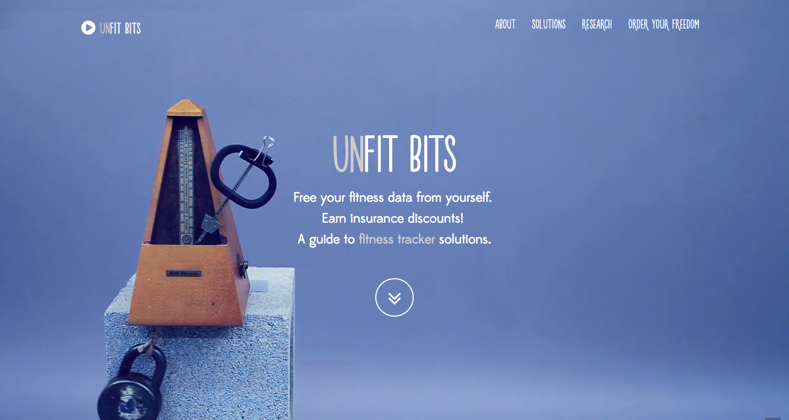
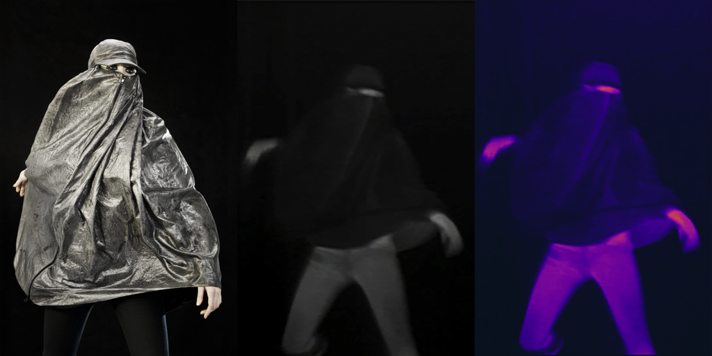

# WEEK `06`: 5 Mar 2018
##  Act: Untrack Me
This week in Quant Humanists, we will look at the ways we can escape the gaze of our trackers. We will also examine how our trackers work, the limitations or intelligence in those measurements, and what ways we might hack our trackers to say different things. 

## PROGRAM

**DISCUSSION**:
 
- Review of Week 5 Assignments
- Updates on class’s data collection, positives, pain-points, debugging, and more. 
- Presentation overview 
- [SLIDES URL](https://docs.google.com/presentation/d/1BX1bX_puR_ipcS0gXgeUrL6RGlbtTyeoi9pIdIlEjnQ/edit#slide=id.g349f224b12_0_0)

**Project Highlight**:

*[Unfitbits](http://www.unfitbits.com/)*, Tega Brain, Surya Mattu + collaborators

*[Stealth Wear](https://ahprojects.com/projects/stealth-wear/)*, Adam Harvey

**STUDIO**:

- In a group, brainstorm a utop/dystop-ic design concept related to personal data metrics or our relationship with quantified self technology. Think: every episode of Black Mirror, Minority Report, Gattaca, District 9. Prepare to pitch/present/sketch the idea at the end of class.

## PRACTICE

- Mozilla, [Open IoT Studio - Projects](https://github.com/openiotstudio)
- Instructables, [DNA Spoofing: DIY Counter Surveillance](http://www.instructables.com/id/DNA-Spoofing-DIY-Counter-Surveillance/)
- Tactical Tech, [Unfitbits workshop](https://tacticaltech.org/news/workshop-the-ultimate-workout/)

## READINGS

- Anonymous, [Kicking tracking, No Picnic](https://unquantifiedself.wordpress.com/2014/04/29/kicking-tracking-no-picnic/)
- Anonymous contributors + Dewey-Hagborg, Heather., [Bioanonymous](http://biononymous.me/)
- Ackerman, Linda, [Mobile Health and Fitness Applications and Information Privacy](https://www.privacyrights.org/sites/default/files/mobile-medical-apps-privacy-consumer-report.pdf)
- Mann S. and Ferenbok J., [New media and the power politics of sousveillance in a asurveillance-dominated world](https://ojs.library.queensu.ca/index.php/)
- Anonymous, [Internet Chemotherapy](https://ghostbin.com/paste/q2vq2)
- Sweeney, Latanya, [My Phone At Your Service](https://www.ftc.gov/news-events/blogs/techftc/2014/02/my-phone-your-service)
- van Dijck, José., [Datafication, datism and dataveillance: big data between scientific paradigm and ideology](https://ojs.library.queensu.ca/index.php/surveillance-and-society/article/view/datafication)

## ADDITIONAL RESOURCES

- Ballano Barcena, M., Wueest, Lau, H., [How Safe is your Quantified Self?](https://www.symantec.com/content/dam/symantec/docs/white-papers/how-safe-is-your-quantified-self-en.pdf)
- Hackernews, [fitbit vulnerabilities](https://thehackernews.com/2015/10/hack-fitbit.html)
- Superflux, [Uninvited Guests](https://vimeo.com/128873380) 
- Brain, Tega, [Unfit Bits](http://tegabrain.com/Unfit-Bits) + [Unfit Bits Project](http://www.unfitbits.com/index.html)                    - Fitbit Hacks [Surveillance](https://www.youtube.com/watch?v=VJnSK4htwoc)
- [FATbit, fitbit hacks](https://www.youtube.com/watch?v=tjTLOKjB_50)
- Anonymous contributors + Dewey-Hagborg, Heather., [A list of bio hacking / surveillance avoidance readings](http://biononymous.me/texts/)
- [How to use 23 and me without giving up your genetic privacy](https://venturebeat.com/2013/09/20/how-to-use-23andme-without-giving-up-your-genetic-privacy/)

## ASSIGNMENT

This week your assignment is obfuscate your date, or circumvent your trackers. 
1. Obfuscate data/circumvention collection assignment. Develop a method to hack one (or more) of your tracking apps. Software or hardware solutions or a combo of both are welcome. Document your process. Write a short reflection about your hack - how did you do it? What information is gained or lost? What are the implications of hacking your data in the way that you did? 
2. Make an instructable about your hack (e.g. http://www.instructables.com/id/DNA-Spoofing-DIY-Counter-Surveillance/)

### Quant Self Intervention
- **About**: Develop a method to hack one (or more) of your tracking apps. Software or hardware solutions or a combo of both are welcome. Document your process. Write a short reflection about your hack - how did you do it? What information is gained or lost? What are the implications of hacking your data in the way that you did?

1. Obfuscate data/circumvention collection assignment. Develop a method to hack one (or more) of your tracking apps. Software or hardware solutions or a combo of both are welcome. Document your process.

2. Make an instructable about your hack (e.g. [DNA Spoofing]http://www.instructables.com/id/DNA-Spoofing-DIY-Counter-Surveillance/); you don't need to make a video, but you should outline the steps to your circumvention in a public place, like [Instructables](http://www.instructables.com/).

- **Submission**: Submit documentation of your quant self intervention - including images, graphics, text descriptions, etc - as a Github Gist/blog post link as a [`comment in its respective github issue` in the quant-humanists-2018 repository](https://github.com/joeyklee/quant-humanists-2018/issues). See NOTE below.
- You will present your concept next class, convince us!

### Blog Post: Reflection
- **About**: write a short reflection about your hack - how did you do it? What information is gained or lost? What are the implications of hacking your data in the way that you did? 
- **Submission**: Submit your Github Gist/blog post link as a [`comment in its respective github issue` in the quant-humanists-2018 repository](https://github.com/joeyklee/quant-humanists-2018/issues). See NOTE below.

**NOTE**: Please structure your blog post submissions according to the assignment template here: [Quant Humanist - assignment template](https://github.com/joeyklee/quant-humanists-2018/blob/master/_templates/assignment-submission-template.md)

