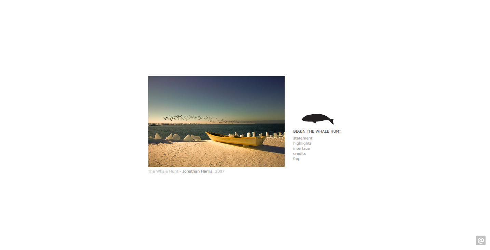

# WEEK `10`: 9 April 2018
##  Special Topics: The Value of You

This week in Quant Humanists, we will discuss the value of you and your data. We will take a thoughtful look into data sharing and publishing and privacy. Here we will examine the various ways our personal data is used for and against us and strategies for protecting our privacy (e.g. obfuscation) while still accessing the services that help us make sense of our lives.

## PROGRAM

- [Slides URL Here](https://docs.google.com/presentation/d/1HAX3qve-JgE4iAGJLTD1T6UEdxM231xgIsowFo1PcqQ/edit?usp=sharing)
- Final Project Critique & Feedback

Aaron Koblin [Bicycle Built for 2,000](http://www.bicyclebuiltfortwothousand.com/info.html
) 

Jonathan Harris [Whale Hunt](http://thewhalehunt.org/) 

## PRACTICE
- MIT Media Lab, [Moral Machine](http://moralmachine.mit.edu/)
- Making a Facebook Ad, [The Complete Guide to Getting Started with Facebook Ads](https://blog.bufferapp.com/facebook-ads)
- [Jonathan Stray, Practical Digital Security for Journalists](https://www.youtube.com/watch?v=KI1Uq7dEjrs)
- [DeepFakes, Siraj Rival](https://github.com/llSourcell/deepfakes) and [how they work](https://www.youtube.com/watch?v=7XchCsYtYMQ) // NOTE: this is a commentary for the cost of publishing your face on the internet for all to use. 
- [Face_Recognition api for python](https://github.com/ageitgey/face_recognition)
- [How Much is your personal data worth? // calculator](https://ig.ft.com/how-much-is-your-personal-data-worth/#axzz2z2agBB6R)
- [Datacoup // Personal Data Marketplace](https://datacoup.com/docs#about)
- [Digi.me // Personal Data Marketplace](https://digi.me/)
- [CitizenMe // Personal Data Marketplace for cities](https://www.citizenme.com/public/wp/about/)

## READINGS
- Radinsky, Kira., [Data monopolists like Google are threatening the economy](https://hbr.org/2015/03/data-monopolists-like-google-are-threatening-the-economy)
- The Economist., [Million-dollar babies](https://www.economist.com/news/business/21695908-silicon-valley-fights-talent-universities-struggle-hold-their)
- Pasquale, Frank., [The dark market for personal data](https://www.nytimes.com/2014/10/17/opinion/the-dark-market-for-personal-data.html)
- Carney, Michael., [You are your data: The scary future of the quantified self movement](https://pando.com/2013/05/20/you-are-your-data-the-scary-future-of-the-quantified-self-movement/)
- [How much does a Facebook Ad really cost?](https://blog.bufferapp.com/facebook-advertising-cost)
- [The cost of sponsored content](https://digiday.com/media/how-top-publishers-handle-sponsored-content/)
- [$1 a day for reaching your walking goals via Oscar](https://www.hioscar.com/faq/5-steps-to-get-more-out-of-your-new-Oscar-plan)
- [Can a fitness tracker help you save on health insurance?, Jan 2017](https://www.policygenius.com/blog/can-a-fitness-tracker-help-you-save-on-health-insurance/)
- [Facebook's "shadow profiles": the involuntary dossiers of information you never provided, and can't opt out of](https://boingboing.net/2017/11/08/involuntary-profiling.html)
- [Grindr Is Letting Other Companies See User HIV Status And Location Data](https://www.buzzfeed.com/azeenghorayshi/grindr-hiv-status-privacy?utm_term=.vbpQDJXLj#.aqVM0o7Yg)
- [What happens when an algorithm cuts your health care](https://www.theverge.com/2018/3/21/17144260/healthcare-medicaid-algorithm-arkansas-cerebral-palsy)
- [How Much Does Your Data Cost?](https://www.wired.com/2011/06/how-much-does-your-data-cost/) // About the cost of using data
- [Greening the Internet: How much CO2 does this article produce?](http://www.cnn.com/2009/TECH/science/07/10/green.internet.CO2/index.html)
- [How much is your personal data worth?](https://www.theguardian.com/news/datablog/2014/apr/22/how-much-is-personal-data-worth)
- [Companies scramble for consumer data, 2013](http://ig-legacy.ft.com/content/f0b6edc0-d342-11e2-b3ff-00144feab7de)
- ['Data soul' of Shawn Buckles sells for £288](http://www.wired.co.uk/article/shawn-buckles-is-worth-350-euros)
- [Bite of Me, Frederico Zannier](https://www.kickstarter.com/projects/1461902402/a-bit-e-of-me)
- [Firms Are Buying, Sharing Your Online Info. What Can You Do About It?](https://www.npr.org/sections/alltechconsidered/2016/07/11/485571291/firms-are-buying-sharing-your-online-info-what-can-you-do-about-it)
- [I Bought a Report on Everything That's Known About Me Online](https://www.theatlantic.com/technology/archive/2017/06/online-data-brokers/529281/) // "...nearly 50 percent of the data in the report about me was incorrect...Many data points were so out of date as to be useless for marketing—or nefarious—purposes..."
- [http://www.aboutads.info/](http://www.aboutads.info/) // C

## ADDITIONAL RESOURCES
- Birkavs, Koedijk, Ming, and Wolbers., [The Quantified Self: Self-Knowledge Through Numbers](http://www.ideefiks.utwente.nl/wp_base/wp-content/uploads/2016/01/Final-Project-Quantified-Self-6_22_2016.pdf)
- Ablon, Libicki, and Golay., [Markets for Cyber crime Tools and Stolen Data](https://www.rand.org/pubs/research_reports/RR610.html)
- Ito, Joichi., [Resisting Reduction: designing our complex future with machines](http://moralmachine.mit.edu/)
- [The Era of Fake Video Begins](https://www.theatlantic.com/magazine/archive/2018/05/realitys-end/556877/)
- [Privacy Pamphlet by Shawn Buckles](http://shawnbuckles.nl/privacypamphlet/
)

## ASSIGNMENT

Continue working on your final projects

