# Datasette Publish Tutorial

## About

In this tutorial we are going to learn about [Datasette Publish](https://simonwillison.net/2018/Jan/17/datasette-publish/), making SQL queries, and retrieving data to be used in a P5.js Application.

The goals of this tutorial are to use [Datasette Publish](https://simonwillison.net/2018/Jan/17/datasette-publish/) to publish an API that allows us to access csv data about a week of our emails and to become familiar with SQL queries. 


## Data

#### Step 1: 1 week of emails

We are going to create a structured csv file that presents 1 week (Monday - Sunday) of our emails. We are going to do this by manually going through our emails and determining the following 

```
date,time,category,replied 

```

* **date**: YYYY-MM-DD
* **time**: HH:MM
* **category**: can be categorized as one of the following: work, personal, automated
* **replied**: true/false


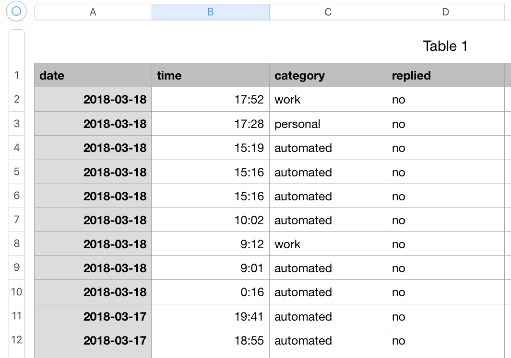


## Publish

#### Step 1: Get started with datasette publish

Go to [https://publish.datasettes.com/](https://publish.datasettes.com/)

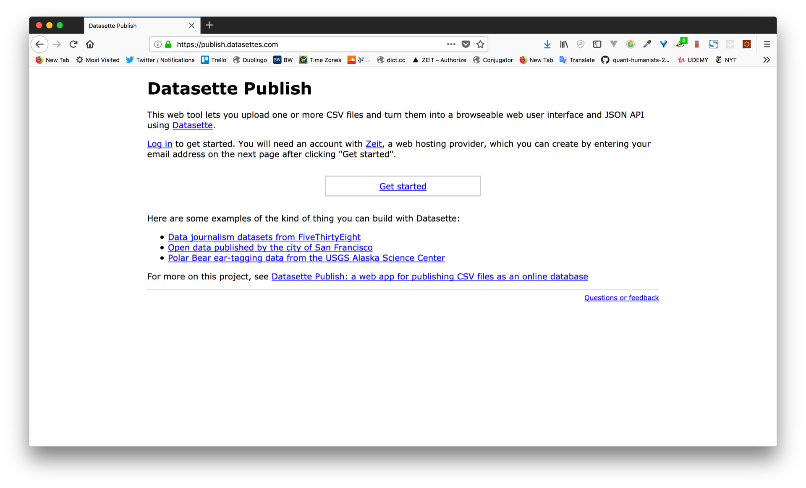

#### Step 2: Sign up with Zeit.co

Sign up with [Zeit](https://zeit.co/). [Zeit](https://zeit.co/) is a platform as a service (PaaS) that provides web space for all your wonderful internet projects. There are free and paid plans. Highly recommended if you're spinning up your own projects.

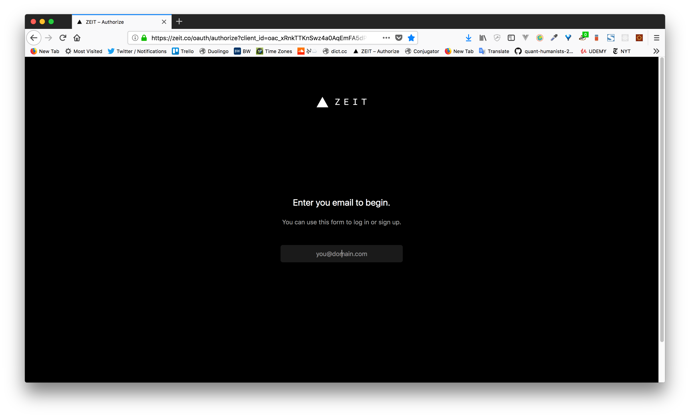
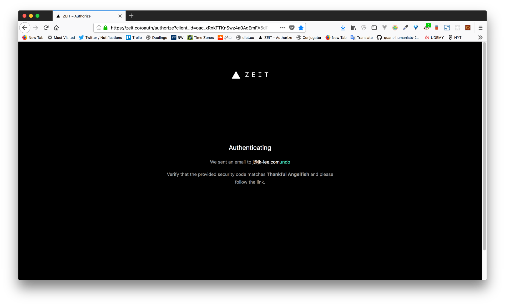
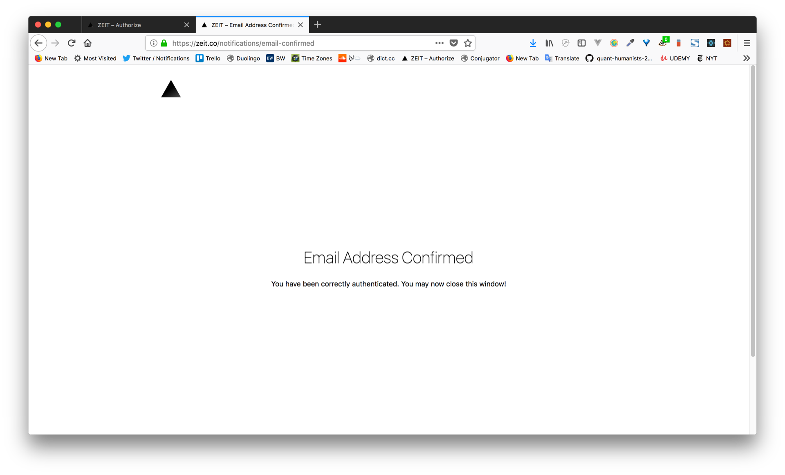

#### Step 3: Allow datasette publish to access

Once you're signed up you will allow datasette publish access to write to your Zeit.co account. 

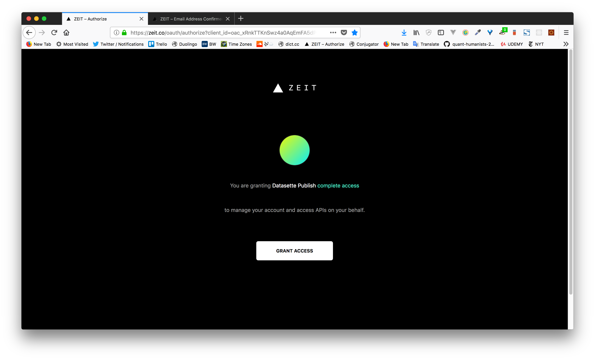


Once you allow access you'll be able to start uploading your CSVs.

### Upload your CSV

Here you will navigate to your CSV and enter in all of the necessary metadata to make your data readable and understandable when you or others decide to access your data. Note that the data that you upload will be accessible via this API so if there's personal info you don't want to share with the world, make sure mask it from your dataset before publishing.

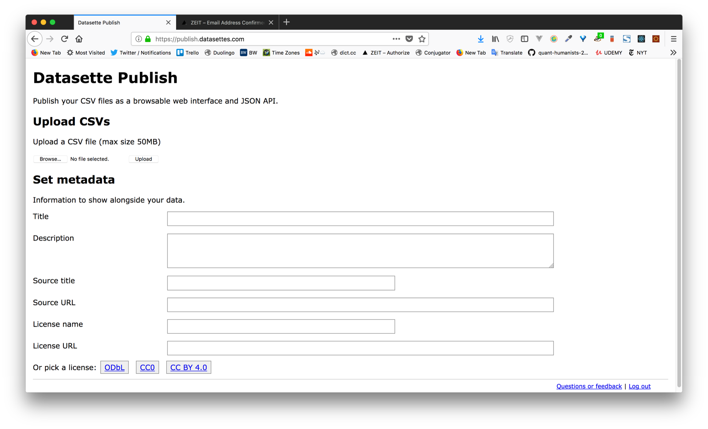
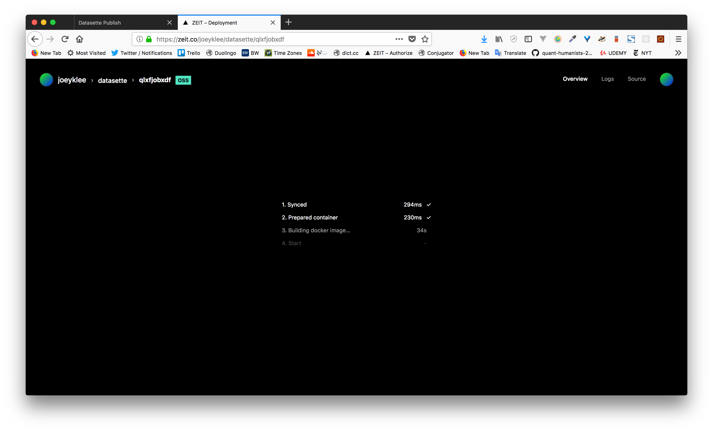

## Our first SQL queries

Before we start sending SQL queries from a `GET` request to the newly created API to our dataset, let's run a few of these queries here in the datasette publish interface to get a feeling for how to make SQL queries.

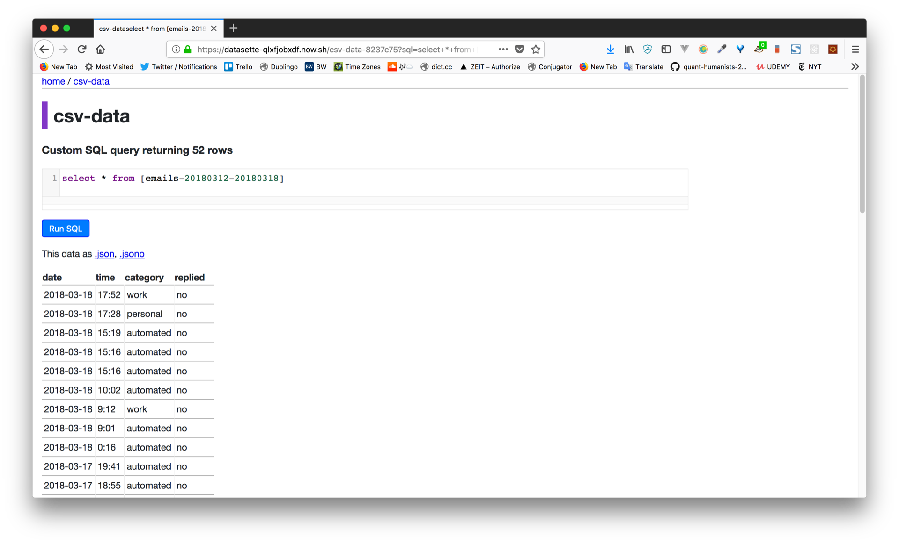


#### SELECT all records from all columns: `SELECT *`

```
SELECT * FROM [YOUR-TABLE-NAME]

```

#### SELECT all records from specified columns: `SELECT COLUMNX, ...`

```
SELECT COLUMNX FROM [YOUR-TABLE-NAME]

```

#### SELECT all records from specified columns: `SELECT COLUMNX, ...`

```
SELECT COLUMNX, COLUMNY FROM [YOUR-TABLE-NAME]

```


#### SELECT all records WHERE the values of columnX match conditionX: `WHERE`

```
SELECT * FROM [YOUR-TABLE-NAME] WHERE COLUMNX = "CONDITIONX"

```

#### SELECT all records WHERE the values of columnX match conditionX `AND` columnY match conditionY: `WHERE` ... `AND`

```
SELECT * FROM [YOUR-TABLE-NAME] WHERE COLUMNX = "CONDITIONX" AND COLUMNY = "CONDITIONY"

```

#### SELECT all records WHERE the values of columnX match conditionX `OR` columnY match conditionY: `WHERE` ... `OR`

```
SELECT * FROM [YOUR-TABLE-NAME] WHERE COLUMNX = "CONDITIONX" OR COLUMNY = "CONDITIONY"

```

#### SELECT Distinct values: `DISTINCT`

```
SELECT DISTINCT(COLUMNX) FROM [YOUR-TABLE-NAME] 
```

#### Retrieve the count of the number of records: `COUNT(*)`

```
SELECT COUNT(*) FROM [YOUR-TABLE-NAME] 

```

#### Retrieve the count of the number of records where the values of columnX match conditionX: `COUNT(COLUMNX)`...`WHERE`

```
SELECT COUNT(*) FROM [YOUR-TABLE-NAME] WHERE COLUMNX = "CONDITIONX"

```

By now you should notice a pattern emerge about how to query a dataset from an SQL database. SQL queries can become much more sophisticated when you decide to do more advanced operations on the data you're querying for. For example, geospatial enabled SQL databases like the `PostGreSQL/PostGis` database you might interact with on the [Carto](https://carto.com/) platform can do fancy geometry and projection handling and more. By becoming comfortable and familiar with how to structure your SQL queries, you will be able to open up range of possibilities when interacting with APIs which use SQL as an interface.


## Visualizing our data

### Making requests to our datasette publish API

We now how our API serving up our data, but how do we access that data from another application? You will notice that when we make a query like this:

```
select * from [emails-20180312-20180318]
```

we end up changing the URL to this:

```
https://datasette-qlxfjobxdf.now.sh/csv-data-8237c75?sql=select+*+from+%5Bemails-20180312-20180318%5D
```

Whats with all the weird characters? Well that's what happens when you encode a text string into a url to make sure the browser can interpret those special characters such as spaces and brackets, etc.

How do we encode our query string? we can use the javascript function `encodeURI()`:

```{js}
encodeURI(`select * from [emails-20180312-20180318]`)
// returns: select%20*%20from%20%5Bemails-20180312-20180318%5D
```

Similarly you can decode that query string via:

```{js}
decodeURI(`select%20*%20from%20%5Bemails-20180312-20180318%5D`)
// returns: select * from [emails-20180312-20180318]

```

We will incorporate the `encodeURI()` function into the way we structure our API requests so that we always send SQL queries that our API can understand.


### Getting data back as `.json`

So far we've been getting our data back in our datasette interface, but how do we get our databack in `.json`? You'll notice that there's a link for [this data as .json](https://datasette-qlxfjobxdf.now.sh/csv-data-8237c75.json?sql=select+*+from+%5Bemails-20180312-20180318%5D) which when you click sends back a json representation of the previously returned table:

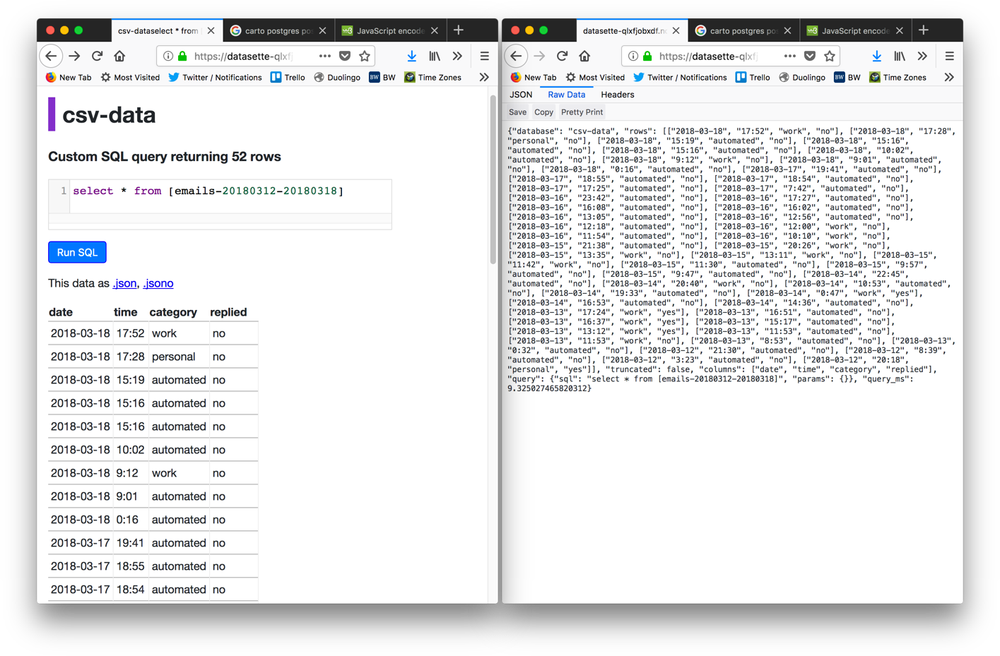

The key thing to note here is that the parameter to return `.json` is added to the url as such. Look closely after the `/csv-data-8237c75` to see where that `.json` parameter was added in:

table:

```
https://datasette-qlxfjobxdf.now.sh/csv-data-8237c75?sql=select+*+from+%5Bemails-20180312-20180318%5D
```

json:

```
https://datasette-qlxfjobxdf.now.sh/csv-data-8237c75.json?sql=select+*+from+%5Bemails-20180312-20180318%5D
```


Alright! So now that we have all those pieces sorted, let's put it all together in our own external application 🚀


### A simple visualization
Pop open the [index.html](index.html) file in your text editor and take a look inside. You'll notice a familiar cast of characters - yes, it's a little P5.js sketch! 

The key features of the sketch are listed below:

#### Your datasette url:

```
const datasetteUrl = `https://datasette-qlxfjobxdf.now.sh/csv-data-8237c75`
```

#### A list of queries in a JS object:

While this is not necessary, you can imagine that if you were to create a zillion new variables to contain these queries, your code will start to become unwieldy. By containing all of our queries in a JS object, we can then reference our queries like `myQueries.automatedCount` or `myQueries.workMails`

```
let myQueries = {
		automatedCount: `SELECT COUNT(*) FROM [emails-20180312-20180318] WHERE category = "automated"`,
		workMails: `SELECT * FROM [emails-20180312-20180318] WHERE category = "work"`
	}
```

#### putting our queries together
We create a function called `encodeQuery()` that takes our `datasetteURL`, `queryString`, and our specified `outputFormat` ==> throws them all together as a string ==> then encodes them using the `encodeURI()` function so that we can make our API requests.

```
function encodeQuery(datasetteUrl,queryString, outputFormat){
		return datasetteUrl + `.${outputFormat}?sql=` + encodeURI(queryString);
	}

```

#### use `loadJSON()` to read our data in

We declare a variable called `test` in our global scope and use `loadJSON()` in the `preload()` function to ensure that before our program starts that our data is assigned to the `test` variable before moving on the our `setup()` and `draw()` functions.

Notice that `loadJSON()` takes the returned string from our `encodeQuery()` function as the first parameter which is the URL where the JSON data should be living.

```
let test;
function preload(){
	//... bunch of httpGet requests for demo...
	
	// get all work mails using loadJSON
		loadJSON(encodeQuery(datasetteUrl, myQueries.workMails, "json"), function(data){
				// assign data to test
				test = data;
		})
}
``` 

#### ShowCount() object 

The `ShowCount()` object contains the functionality for showing the   counts for the number of work emails that have been answered by Joey during his work of emails. Clearly Joey has to get his act together! The main things to know about this `ShowCount()` object is that it ensures that we don't muddy up the global scope with a bunch of variables and so we can exercise better control over the visualizations that might be derived from the data contained in it. For more on JS objects, see [Coding Train with Dan Shiffman // JS Objects](https://www.youtube.com/watch?v=-e5h4IGKZRY).

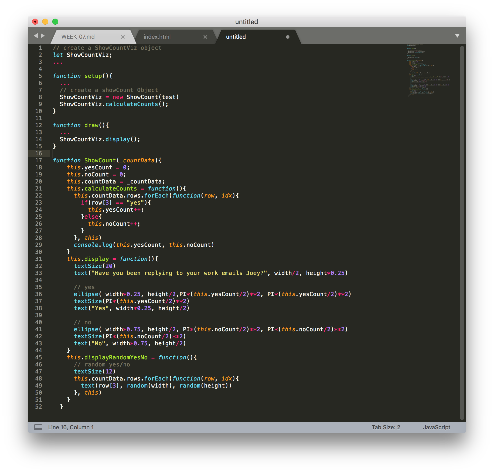

Putting this all together now, we can start to create visualizations like the very confronting one below. It's simple, but you can see that there's a number of considerations to go from [creating your own data](#Data), to [making your data accessible via an API](#Publish), to [making structured requests to your API](##Our-first-SQL-queries), and finally [showing a visual representation of that data](##Visualizing-our-data).


Using the data from your API, what other visualizations might you try to create? How might you convey the sense of time? How about small multiples? What about interaction? What other data might you need to convey the delay time in your replies?


## Challenge!

Using your dataset, find out the following pieces of information:

* which day did you have the most emails?
* which day did you reply to the most emails?
* which day did you receive the most automated messages?


***


## Cheatsheet:

Some handy tutorials:

* http://www.informit.com/articles/article.aspx?p=29661&seqNum=2
* https://www.geeksforgeeks.org/sql-select-query/
* https://www.w3schools.com/sql/sql_count_avg_sum.asp

#### Get all records
select * from [emails-20180312-20180318]

#### Get the distinct data from the `category` field
SELECT DISTINCT category FROM [emails-20180312-20180318]

#### Get all data records where you replied
SELECT * FROM [emails-20180312-20180318] WHERE replied IS "yes"

#### Get only the records from date & category where you replied
SELECT date, category FROM [emails-20180312-20180318] WHERE replied IS "yes"

#### Get all data records where category is automated
SELECT * FROM [emails-20180312-20180318] WHERE category = "automated"
SELECT * FROM [emails-20180312-20180318] WHERE category IS "automated"

#### Get the count of the records where the category is automated
SELECT COUNT(*) FROM [emails-20180312-20180318] WHERE category = "automated"

#### Multiple conditions w/ AND
SELECT * FROM [emails-20180312-20180318] WHERE replied = "no" AND date = "2018-03-18"

#### Multiple conditions w/ OR
SELECT * FROM [emails-20180312-20180318] WHERE category = "work" OR date = "2018-03-18"

